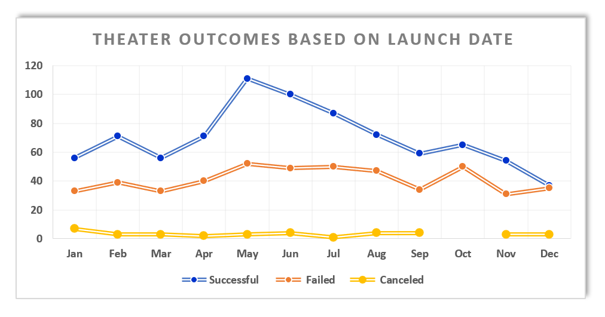
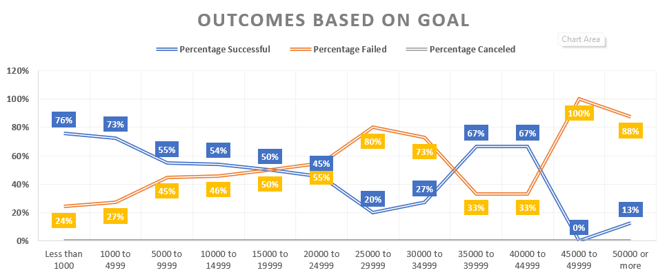
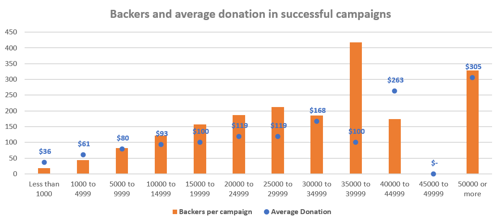

# Kickstarting with Excel

## Overview of Project

### Purpose
This project is persuading to provide data for Louise, who wants to start a crowdfunding campaign for her play called Fever, which has an estimated budget of over $10,000 usd. She needs an overview of previous campaigns so we've analyzed the outcomes of more than 1K campaigns from 19 countries based on the month they were launched as well as the goal they were pursuing.  Within all these insights we'll give direction to Louise to take decisions on her campaign in order to be successful.
## Analysis and Challenges

### Analysis of Outcomes Based on Launch Date
Our dataset provided the outcomes of 1,369 campaigns **related to theater** from 2009 to 2016, based on the month that they were launched and it showed that May might be the best time to start with Louise campaign due to the effectiveness that we can visualize in the next chart where 111 campaigns out of 166 were successful (67% chance to be successful).
The least recommended month for Louise to launch her campaign would be December considering that only 49% of the campaigns made it to be successful.

### Analysis of Outcomes Based on Goals
We went deeper this time and focused the analysis on the subcategory **plays**  to give Louise a closer overview for the specific kind of campaign that she is persuading. So our dataset provided 1047 project's outcomes; successful, failed and canceled, but we needed to group this based on their goal amount and we could figure out what are the campaign's chances to succeed considering she has budgeted 10,000 usd.

### Challenges and Difficulties Encountered
Strictly following the challenge instructions I think we missed that the data contains different currency values so we could filter only the campaigns based on USA and GB for an accurate analysis. Technically I think that the most challenging topic was to fully understand the Unix timestamps concepts because working with date formats in excel always has been hard for me and in addition I'm used to work with another region dates format dd/mm/yyyy instead of mm/dd/yyyy.

- What are two conclusions you can draw about the Outcomes based on Launch Date?

1. We recommend Louise to launch her campaign in May or June based on the pattern that was revealed in our dataset where 65 to 67 percent of these campaigns were successful.

2. We do not recommend Louise to launch in December because our data shows that 51% of the campaigns failed this month. 

- What can you conclude about the Outcomes based on Goals?

Louise is setting a 10000 goal so if we looked at the chart that grouped 12 ranges we could forecast that her campaign has a 54-55 percent chances to be successful.

- What are some limitations of this dataset?

If I were Louise I'd like this data to contain amounts related to taxes, advertising expenses or maybe administration fees of the crowdfunding platform. With all this data we could set a goal more realistic that fulfills the project's needs.

- What are some other possible tables and/or graphs that we could create?

We'd like to give Louise a reference of how many backers she'll need based on the amount of her goal as well as the donation she has to promote or motivate among the possible backers. For this we can provide the next chart to have a reference; If the project needs up to 10000 USD, we'd set a goal of 122 backers and motivate that each one donates a minimum of 93 USD.

